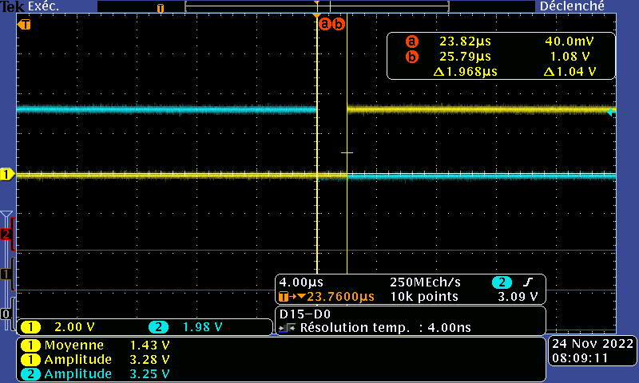
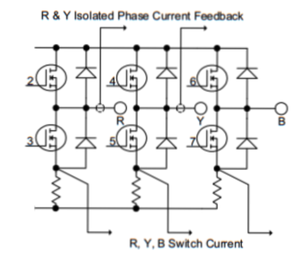
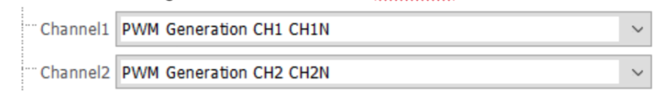
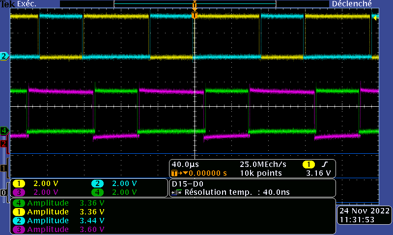
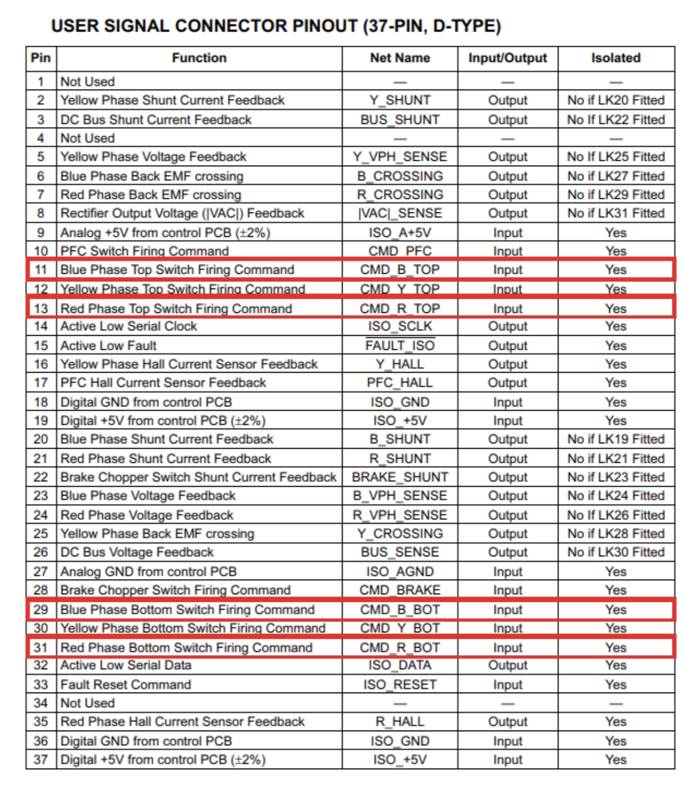
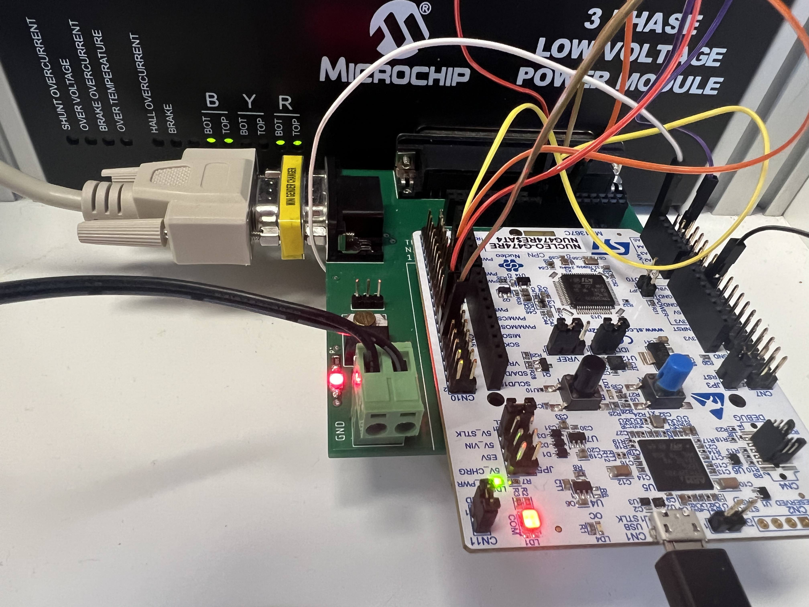

# TP - Actionneurs et automatique appliquée

## Notre groupe
* RUIZ Guilhem
* HERBELIN Benjamin
* LENOIR Adrien

## Objectifs du TP
Le but de ce TP filé est de réaliser la commande asservie d'un moteur à courant continu, par l'intermédiaire d'un shell et d'un hacheur à commande complémentaire décalée. Le software est executé sur une carte Nucleo (microcontrôleur STM32G474RET6).
Pour ce faire, plusieurs réalisations intermédiaires sont à implémenter:

* Écriture d'un shell, acceptant quelques commandes basiques pour le contrôle du moteur à venir (start, stop, speed xxx, etc...)
* Branchement et activation logicielle des broches utilisées de la carte Nucléo (UART pour communiquer les ordres via le shell, PWMs pour le contrôle des 4 transistors du hacheur, GPIOs, etc...)
* Codage des fonctions appelables par le shell pour l'allumage et l'éteignage du moteur, et la sélection d'une vitesse à atteindre par celui-ci.
* Réalisation de l'asservissement, via capteurs et boucle de traitements logiciels sur l'intensité électrique consommée et la vitesse de rotation du rotor.
* (Documentation du tout avec l'outil Doxygen)


## En séance 

### Le Shell

### PWM complémentaire décalée - STM32

Les temps morts : 

Nous souhaitons un dead-time de 2us avec une résolution à 10 bits. Pour obtenir ce résultat, il faut réaliser quelques calculs préliminaires. Une résolution à 10 bits signifie que nous avons un ARR avec une valeur de 1024.

$F_{clk} = 164MHz \Rightarrow  T_{clk} = 6{,}1ns$
$DT = 2 \mu s$

Grâce à la documentation qui nous est donné dans le cours, nous pouvons déterminer le Dead Time : 

<p align="center"></p>
<p align="center">Figure 1 : Formule pour obtenir le Dead Time</p>

On sait que : 

$DTG[4:0] = \frac{DT\cdot f}{8} -32 \Leftrightarrow DTG[4:0] = 2\cdot10^{-6}\cdot \frac{164\cdot10^6}{8} - 32$

$DTG[4:0] = 9 \Rightarrow 0 1001$

Et : 
$DTG[7:5] = 110$

$DTG[7:5] = 110$

Donc : 

$DTG = 1100 1001 = 201$

Pour obtenir un temps mort de $2\mu s$, il faut un DTG de 201.

<p align="center"></p>
<p align="center">Figure 2 : Capture du temps mort</p>

Sur l’oscilloscope, nous obtenons bien $2\mu s$ de temps mort. Nos calculs sont donc corrects.

PWM :

Nous souhaitons créer une PWM complémentaire décalée pour contrôler notre hacheur et par conséquent notre moteur. Nous souhaitons que les transistors H1 et H4 soient fermés pendant que les transistors H2 et H3 sont ouverts. Pour reproduire ce pattern, il nous faut donc deux channels avec des PWM complémentaires.

<p align="center"></p>
<p align="center">Figure 3 : Hacheurs 4 quadrants</p>

Voici comment sont configurés nos channels sur CubeIDE : 

<p align="center"></p>
<p align="center">Figure 4 : Configuration des channels 1 et 2 du timer 1</p>

Les PWM des channels 1 et 2 sont respectivement branchées sur les broches PA8 et PA11 ainsi que PA9 et PA12. 

Nous avons utilisé 4 sondes pour visualiser les allures des 4 PWM et un peu plus tard dans les TP, nous avons aussi utilisé une sonde numérique pour les visualiser. Voici ce que nous obtenons :

<p align="center"></p>
<p align="center">Figure 5 : Allure des PWM complémentaire décalées</p>
<p align="center">(Jaune : CH1, Violet : CH1N et Bleu : CH2, Vert :CH2N)</p>

Ce qu’on voit sur la capture ci-dessus sont des PWM décalées avec un rapport cyclique de 60%. Pour les obtenir, nous avons défini le channel 1 à 60% et le channel 2 à 40% en utilisant les fonctions : 


```c
__HAL_TIM_SetCompare(&htim1, TIM_CHANNEL_1, 614);
__HAL_TIM_SetCompare(&htim1, TIM_CHANNEL_2, 410);
```

### Hacheur et MCC

Dans cette partie, le but est de contrôler le hacheur avec le STM32. Nous utilisons les phases “Bleue” et “Rouge”. Pour ce faire, il faut brancher la STM32 au connecteur 37 broches. En regardant la documentation, nous savons que les broches à connecter sont les suivantes : 

<p align="center"></p>
<p align="center">Figure 6 : Documentation sur le connecteur 37 broches</p>

Une fois que la STM32 est reliée au hacheur, le hacheur nous affiche des messages d’erreur par le biais des LEDs rouges. Ces messages d’erreurs s’activent parce que nous n’avons pas encore lancé la séquence de démarrage. Une fois que nous l’effectuons, les messages d’erreurs corrigés et les LEDs sur le hacheur deviennent jaunes. Ça indique que le hacheur fonctionne correctement. 
De la même manière, on remarque que les LED “Blue-Bottom” et “Blue-Top” ainsi que “Red-Bottom” et “Red-Top” s’allument, affirmant le bon câblage du hacheur.

<p align="center"></p>
<p align="center">Figure 7 : LED de vérification du fonctionnement du hacheur</p>

Après avoir correctement câblé la MCC et le hacheur, nous nous sommes aperçu qu’il manquait les fonctions permettant de gérer le rapport cyclique et donc la vitesse de la MCC. Nous avons donc créé une fonction, disponible ci-dessous, comprenant deux cas : un pour baisser le rapport cyclique et l’autre pour l’augmenter.

### Le bouton EXTI


* Réaliser la séquence d'allumage sur une GPIO quelconque

La séquence d’allumage consiste à passer la broche adéquate (PC3) du driver moteur durant une seconde à l’état haut, ce qui se fait directement en modifiant l’état d’un GPIO (en output) via la fonction `AL_GPIO_WritePin(GPIOX, GPIO_PIN_x, GPIO_PIN_SET*)`.

\* Puis `GPIO_PIN_RESET`, le cas échéant.

* Commander cette séquence d'allumage de 2 façons :

Deux fonctions sont codées dans le fichier fonctions_shell.c : `start()` et `stop()`. La fonction `start()` lance simplement la séquence d’allumage (voir plus haut). La fonction `stop()` ne fait rien pour le moment.

* Sur l'appui du bouton bleu de la carte avec une gestion d'interruption lors de l'appui sur le bouton bleu (EXTI).
En passant par un flag indiquant l’état courant du moteur (allumé/éteint), il n’y a qu’à faire basculer l’alimentation du hacheur (via les fonctions `start()`/`stop()`) vers l’état opposé à chaque entrée dans l’interruption EXTI3.

* Sur la réception en uart de la commande "start".

Via l’appel par le shell, il suffit de rajouter deux cas dans le if/else if/else. Ceux-ci appellent les mêmes fonctions que le bouton bleu, les fonctions `start()` et `stop()`.

Pour renseigner le rapport cyclique alpha désiré, puisque le ARR du timer employé est choisi à 1024, il suffit d’attribuer la bonne valeur au registre `TIM1->CCR`, par exemple en employant la fonction `__HAL_TIM_SetCompare(&htimx, TIM_CHANNEL_x, value)`,  où value est donné par `(int)alpha*ARR`, soit `(int)alpha*1024` ici.

## Avancements

* Le shell est codé et implémente les fonctions basique *help*, *pinout*, *start* et *stop*, où :
  * *help* renvoit le nom des trois autre commandes disponibles, ainsi que leur utilité
  * *pinout* renvoit la liste des broches du microcontrôleur utilisées, ainsi que leur rôle/assignation
  * *start*, qui ne fait rien pour le moment
  * *stop*, qui ne fait rien pour le moment
* Les broches concernées sont activées et assignées aux bons protocoles
* Fonctions de commandes codées : NON
* Asservissement réalisé : NON
